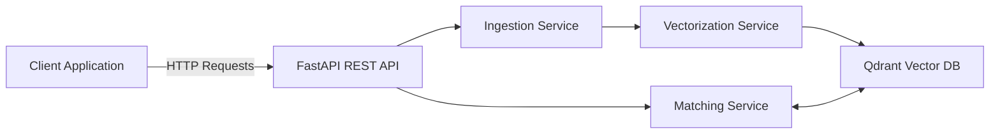

# Career AI

## 🧠 Overview

**Career-AI** is an intelligent backend service for managing and analyzing **positions**, **candidates**, and **skills** using FastAPI and vector embeddings.

It provides:

- RESTful API for managing positions, candidates, and skills
- Vector-based similarity search using Qdrant
- Smart matching between candidates and positions
- Skill gap analysis
- Type-safe models with Pydantic validation

---

## 🚀 Quick Start

### Prerequisites

- Python 3.13+
- Docker & Docker Compose

### Installation

```bash
# Install dependencies
pip install -e .

# Run with Docker Compose
docker-compose up

# Or run locally
uvicorn app.main:app --reload
```

The API will be available at `http://localhost:8000`

Interactive API documentation: `http://localhost:8000/docs`

---

## 📌 API Endpoints

All endpoints are prefixed with `/api/v1` and follow RESTful conventions.

### `/api/v1/candidates`

| Method | Route                    | Body              | Returns           | Description                    |
|--------|--------------------------|-------------------|-------------------|--------------------------------|
| POST   | `/candidates/`           | `Candidate`       | `Candidate`       | Create a single candidate      |
| POST   | `/candidates/batch`      | `List[Candidate]` | `List[Candidate]` | Create multiple candidates     |
| GET    | `/candidates/`           | —                 | `List[Candidate]` | Get all candidates             |
| GET    | `/candidates/{id}`       | —                 | `Candidate`       | Get candidate by ID            |
| PUT    | `/candidates/{id}`       | `Candidate`       | `Candidate`       | Update candidate               |
| DELETE | `/candidates/{id}`       | —                 | —                 | Delete candidate               |
| DELETE | `/candidates/`           | —                 | —                 | Delete all candidates          |

---

### `/api/v1/positions`

| Method | Route                    | Body              | Returns          | Description                    |
|--------|--------------------------|-------------------|------------------|--------------------------------|
| POST   | `/positions/`            | `Position`        | `Position`       | Create a single position       |
| POST   | `/positions/batch`       | `List[Position]`  | `List[Position]` | Create multiple positions      |
| GET    | `/positions/`            | —                 | `List[Position]` | Get all positions              |
| GET    | `/positions/{id}`        | —                 | `Position`       | Get position by ID             |
| PUT    | `/positions/{id}`        | `Position`        | `Position`       | Update position                |
| DELETE | `/positions/{id}`        | —                 | —                | Delete position                |
| DELETE | `/positions/`            | —                 | —                | Delete all positions           |

---

### `/api/v1/skills`

| Method | Route                    | Body         | Returns           | Description                    |
|--------|--------------------------|--------------|-------------------|--------------------------------|
| POST   | `/skills/hard`           | `HardSkill`  | `HardSkill`       | Create a hard skill            |
| POST   | `/skills/soft`           | `SoftSkill`  | `SoftSkill`       | Create a soft skill            |
| GET    | `/skills/hard`           | —            | `List[HardSkill]` | Get all hard skills            |
| GET    | `/skills/soft`           | —            | `List[SoftSkill]` | Get all soft skills            |
| GET    | `/skills/hard/{id}`      | —            | `HardSkill`       | Get hard skill by ID           |
| GET    | `/skills/soft/{id}`      | —            | `SoftSkill`       | Get soft skill by ID           |
| DELETE | `/skills/hard/{id}`      | —            | —                 | Delete hard skill              |
| DELETE | `/skills/soft/{id}`      | —            | —                 | Delete soft skill              |
| DELETE | `/skills/`               | —            | —                 | Delete all skills              |

---

### `/api/v1/smart` (AI-Powered Matching)

| Method | Route                      | Query Parameters                  | Returns             | Description                              |
|--------|----------------------------|-----------------------------------|---------------------|------------------------------------------|
| GET    | `/smart/candidates/top`    | `position_id`, `limit=10`         | `List[MatchResult]` | Top candidates for a position            |
| GET    | `/smart/candidates/similar`| `candidate_id`, `limit=10`        | `List[MatchResult]` | Similar candidates                       |
| GET    | `/smart/positions/top`     | `candidate_id`, `limit=10`        | `List[MatchResult]` | Top positions for a candidate            |
| GET    | `/smart/positions/similar` | `position_id`, `limit=10`         | `List[MatchResult]` | Similar positions                        |
| GET    | `/smart/gaps`              | `candidate_id`, `position_id`     | `List[SkillGap]`    | Analyze skill gaps                       |

**Query Parameters:**
- `limit`: Number of results to return (1-100, default: 10)
- IDs are required for matching operations

---

## 🏗️ Project Structure

```
career-ai/
├── app/
│   ├── __init__.py
│   ├── main.py                 # FastAPI application entry point
│   ├── api/
│   │   └── v1/
│   │       ├── __init__.py
│   │       └── routers/
│   │           ├── candidates.py    # Candidate endpoints
│   │           ├── positions.py     # Position endpoints
│   │           ├── skills.py        # Skills endpoints
│   │           └── smart.py         # AI matching endpoints
│   ├── models/
│   │   ├── BaseValues.py       # Enums and base types
│   │   ├── Candidate.py        # Candidate model
│   │   ├── Position.py         # Position model
│   │   ├── Profile.py          # Profile model
│   │   └── Skill.py            # Skill models
│   ├── services/
│   │   ├── ingestion.py        # Data ingestion service
│   │   ├── vectorization.py    # Embedding generation
│   │   └── matching.py         # Matching algorithms
│   ├── vector_db/
│   │   └── client.py           # Qdrant client wrapper
│   └── core/
│       └── config.py           # Configuration settings
├── docker-compose.yaml
├── pyproject.toml
├── .gitignore
└── README.md
```

---

## 🏗️ Architecture

### System Components

1. **REST API Layer** - FastAPI-based REST endpoints
2. **Ingestion Service** - Data validation and processing
3. **Vectorization Service** - Convert data to embeddings
4. **Vector Store** - Qdrant for similarity search
5. **Matching Service** - AI-powered candidate-position matching

### Data Flow

- **Candidate/Position Creation:** Client → API → Ingestion → Vectorization → Qdrant
- **Smart Matching:** Client → API → Qdrant (similarity search) → Response
- **Skill Gap Analysis:** Client → API → Compare vectors → Gap calculation

### High-Level System Diagram



---

## 🛠️ Technology Stack

- **Framework:** FastAPI 0.116+
- **Language:** Python 3.13+
- **Validation:** Pydantic with type hints
- **Vector Database:** Qdrant 1.12+
- **Database:** SQLAlchemy 2.0+
- **Server:** Uvicorn
- **Containerization:** Docker & Docker Compose
- **Testing:** Pytest

---

## 📦 Data Models

### Candidate

```python
{
  "name": "John Doe",
  "candidate_id": "uuid-generated",
  "current_position": Position,
  "past_positions": [Position],
  "hard_skills": [HardSkill],
  "soft_skills": [SoftSkill]
}
```

### Position

```python
{
  "title": "Software Engineer",
  "position_id": "uuid-generated",
  "description": "Job description...",
  "required_hard_skills": [HardSkill],
  "required_soft_skills": [SoftSkill],
  "experience_years": 3
}
```

### Skills

```python
# HardSkill
{
  "skill": "Python",  # from HardSkills enum
  "level": 4.5,       # 0-5 range
  "id": "uuid-generated"
}

# SoftSkill
{
  "skill": "Communication",  # from SoftSkills enum
  "level": 4.0,              # 0-5 range
  "id": "uuid-generated"
}
```

---

## 🔧 Configuration

Environment variables (configured in `.env` or `docker-compose.yaml`):

```env
# Application
APP_NAME=Career AI
APP_VERSION=1.0.0
DEBUG=false

# Database
DB_USER=admin
DB_PASSWORD=secret
DB_NAME=test.db

# Qdrant Vector Database
QDRANT_HOST=localhost
QDRANT_PORT=6333
QDRANT_COLLECTION_CANDIDATES=candidates
QDRANT_COLLECTION_SKILLS=skills
QDRANT_VECTOR_SIZE=384

# API
API_V1_PREFIX=/api/v1
```

---

## 🧪 Development

### Running Tests

```bash
pytest
```

### Local Development

```bash
# Install in development mode
pip install -e .

# Run with auto-reload
uvicorn app.main:app --reload --host 0.0.0.0 --port 8000
```

### Docker Development

```bash
# Build and run
docker-compose up --build

# Run in detached mode
docker-compose up -d

# View logs
docker-compose logs -f web

# Stop services
docker-compose down
```

---

## 📝 License

This project is provided as-is for educational and development purposes.
